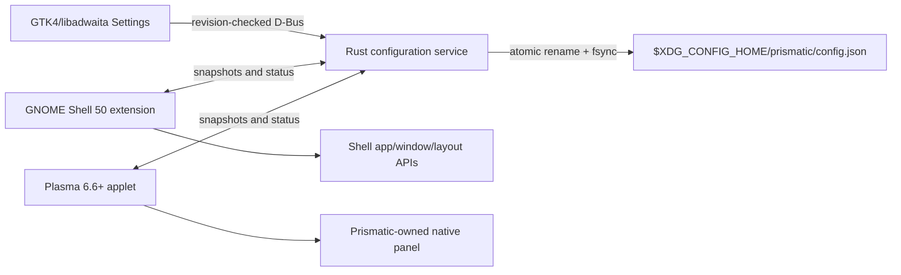

# Architecture

Prismatic separates durable policy from desktop-native presentation. The service owns
validation and persistence; adapters own shell integration and keep only disposable
caches needed to survive service restarts.

## Shared service

`prismatic-service` owns `io.github.CoJoA13.Prismatic.Service` on the session bus and
exports `/io/github/CoJoA13/Prismatic` with interface
`io.github.CoJoA13.Prismatic.Service1`. D-Bus activation and a user systemd unit both
start the same binary. A process-lifetime lock beside the configuration prevents
competing writers; the object path is advertised before the well-known bus name is
acquired. Every write includes the last observed revision. Imports keep
`config.json.bak`; malformed on-disk snapshots are moved to `config.json.corrupt*`.

The service resolves default Fedora application roles and verifies pinned launchers
against XDG application directories. It records no launches and performs no network I/O.

## Settings application

The application ID is `io.github.CoJoA13.Prismatic`. The settings process reads and
writes only through D-Bus. It exposes all schema-v1 values, import/export, diagnostics,
and explicit actions to enable the GNOME extension or create a dedicated Plasma panel.

## GNOME adapter

The extension UUID is `prismatic@cojoa13.github.io`. It creates an independent
St/Clutter actor via Shell layout APIs, groups applications, reserves work area only
in fixed mode, and uses a pressure barrier for hidden modes. Private Shell calls are
confined to `shellCompat.js`. Disable tears down signals, barriers, keybindings, menus,
timeouts, and chrome.

## Plasma adapter

The settings action creates a panel only if no panel already contains the Prismatic
applet. The applet stores its containment ID as `ownedPanelId`, maps the shared geometry
to native panel properties, and relies on Plasma's task model. Removal and management
must validate the applet and recorded panel ID before touching a containment. Output
topology signals re-apply the selected connector or primary fallback. Plasma's public
panel API does not expose per-panel reveal/hide delays, so Plasma retains compositor
timing while GNOME applies the shared delay values.

## Failure behavior

Adapters keep the latest valid snapshot in a non-authoritative cache. A disconnected
selected connector falls back to primary. Invalid config is rejected at the service
boundary. Fullscreen blocks pointer reveal; the explicit shortcut remains available.
